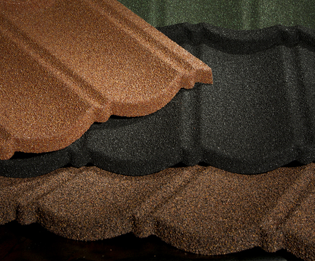

Bond are roofing tiles based on a continuous technological development improvment of its' quality standards. This smart product is shaped according to traditional ceramic roofing tiles and uses the top quality steel sheet with anti-corrosion protection layer Aluzinc. For even higher corrosion protection in an aggressive environment, like sea-side resorts or agricultural farms, bond is recommended. Bond has also an extra protection by organic back-coat on the bottom side.
