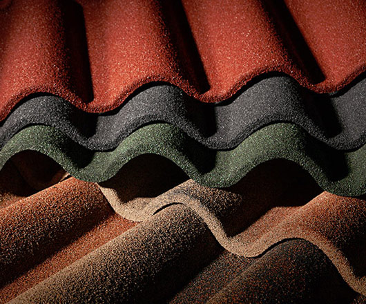

Sometimes it's time to do something different than the others do. In 2007, EVERTILE, introduced the lightweight steel tiles with the authentic Mediterranean traditional style of roof tiles - COPPO. It is possible to achieve the appearance of the typical Mediterranean architecture with minimal load of the building structures, either in new projects or in reconstructions. Evertile COPPO color solutions and designs are still unique and are becoming increasingly popular with customers across Europe as well as in other territories.
