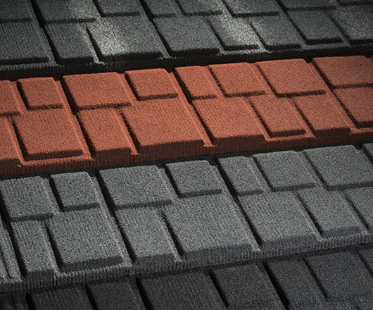

Roof tiles SHINGLE are new in the Evertile offer, since 2016. SHINGLE design is inspired by the bitumen shingle or slate plates style of roof covering popular in the USA. Rectangular shapes evoke the look of stacked bitumen shingles, but the profile is made with more 3Defect, roof covering is stiffer and stronger, much more durable and attractive. SHINGLE is capable to carry high snow load as well as high velocity wind.
